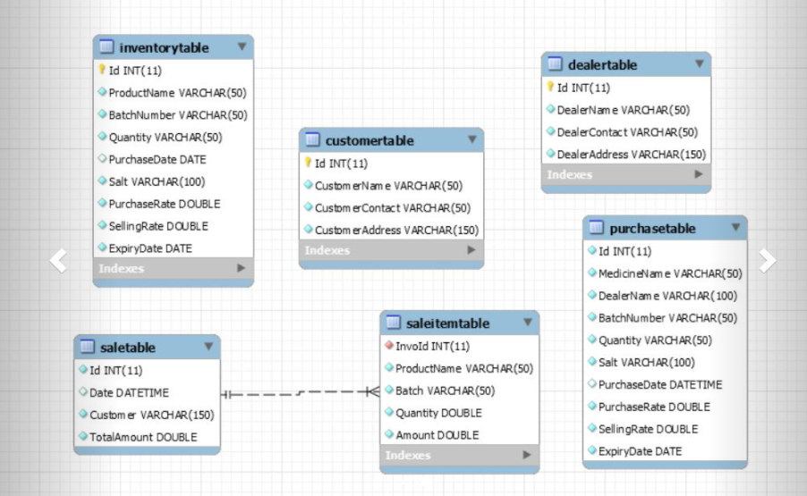
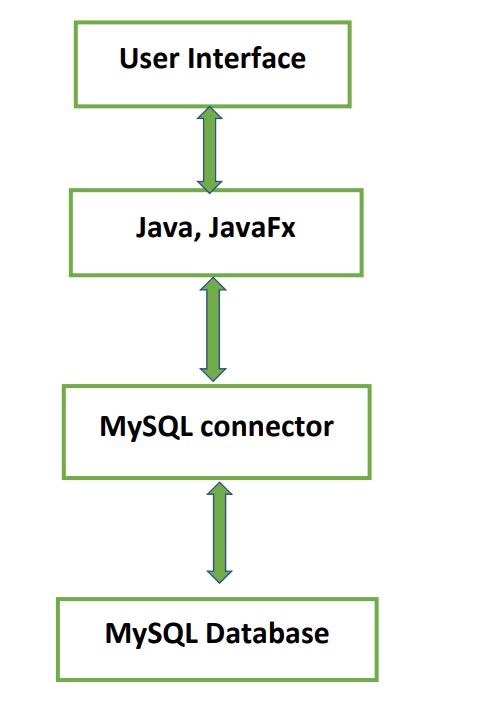
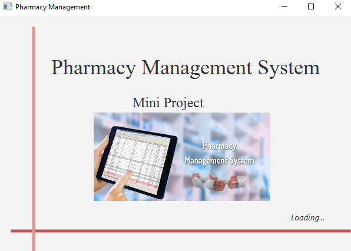
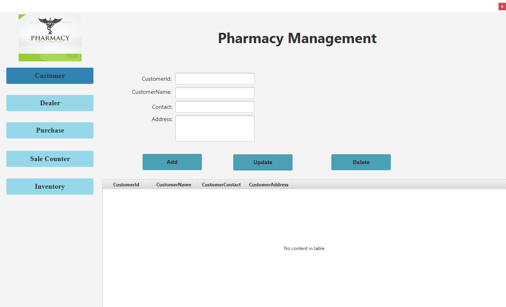
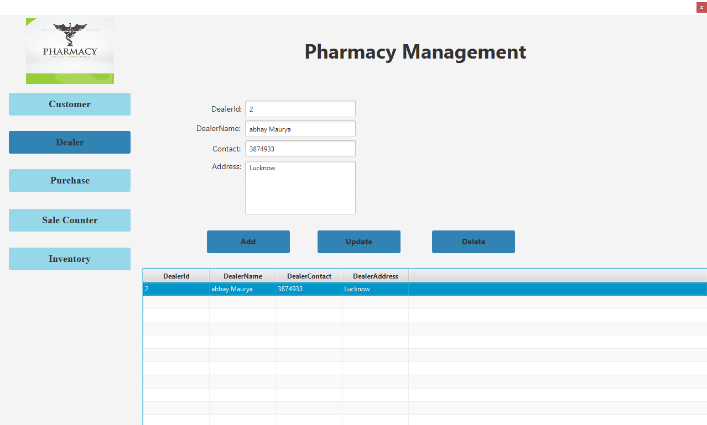
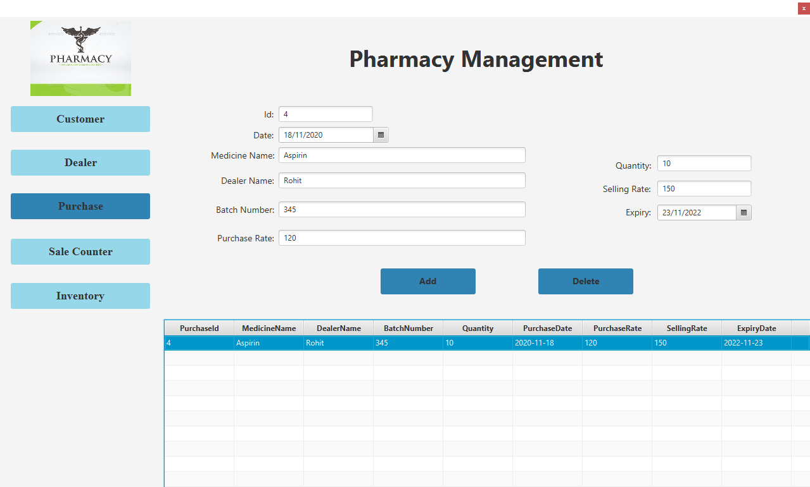
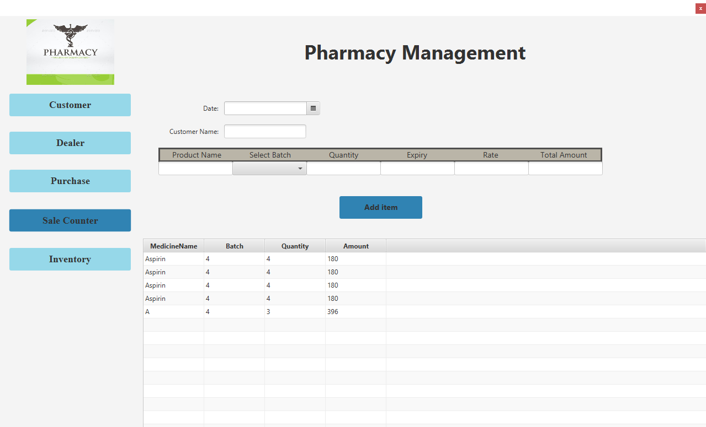
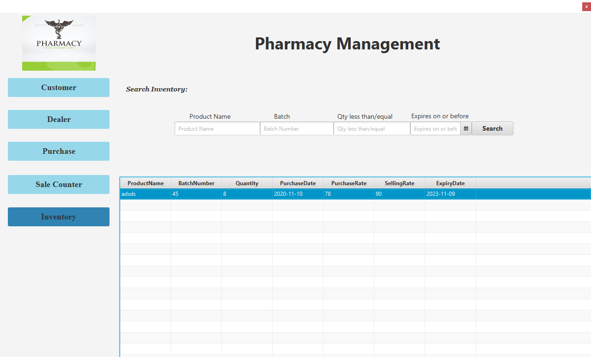

# DBMS
## Problem Statement:
The project starts by adding a dealer and by adding details of customer. The user can
now purchase new medicines by the desired dealer and then can sell them to the
customer added the purchasing and selling of medicines is reflected in the inventory
section. The main aim of Pharmacy Management Mini DBMS project is to rent
apartments and get payments from respective tenants. We aim to demonstrate the
use of create, read, update and delete MySQL operations through this project.

## DB Design Diagram

## Architecture
* Pharmacy Management System designed as an Desktop Application, first
opens a Splash Screen / Start (Loading) Screen, then Main Window, which is
handled on only single XML file.
* The pages can be traversed using buttons present on the left side of the screen
* For each page the table is displayed at the lower side of the screen.

            
## Overview of Application
* The project is made using Java and designed using Javafx. The backend is
maintained using mysql.
* Project consists of 5 main pages namely Customer , Dealer , Purchase , Sale
Counter and Inventory.
* The Customer and Dealer page is used to insert , delete and alter enteries of
customer and drug suppliers respectively.
* Purchase and Sale Counter is used to make enteries regarding purchase and
sale of drugs and include date , dealer/customer, price , expiry date , etc.
* Inventory is used to search for all drugs currently present in warehouse and
can also search for various medicines using name , batch , etc.

## Functionalities

### 1. Customer and Dealer Page
* To add new Customer/Dealer , ‘Add’ button is to be selected.
* Enter id, name, contact and address of customer in Text Field to add in the
table.
* To update any row, select given row, the data of given row will be carry in Text
Field of the desired Field and we can change the data, click ‘Update’ button to
update the selected Field.
* To delete any row, select the row and then click on ‘Delete’ button.
* After each operation the table field is updated automatically.
* After each change the table is updated and automatically displayed on page
itself.

### 2. Purchase
* To add new Purchase, ‘Add’ button is to be selected.
* Enter id, Purchase Date, Medicine Name, Dealer Name, Batch Number,
Purchase Rate, Quantity of a particular type of medicine, Selling Rate and
Expiry Date of Medicine.
* To delete any row, select the row and then click on ‘Delete’ button.
* After each operation the table field is updated automatically.

### 3. Sale Counter
* From Sale Counter, customer can buy any product and its data is maintained.
* The Sale table consists of date of Sale, Customer Name and other product
details.
* The medicine only appears in the list if it is available in the inventory.

### 4. Inventory
* In inventory, every Purchases will be visible and we can search of given
type of product.
* To manage purchases and sales we can navigate in inventory table.
* The products can also be searched using product name , batch , quantity
and expiry date individually

